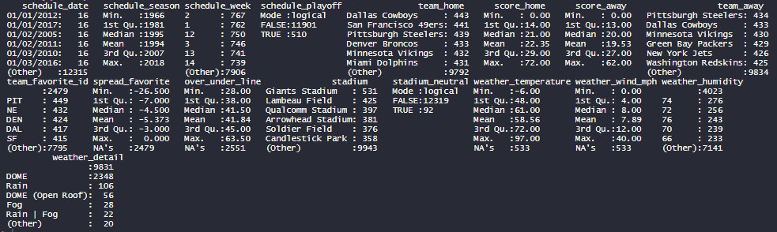
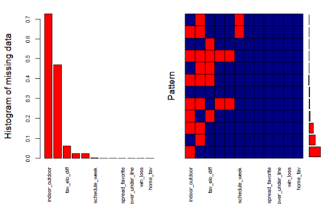
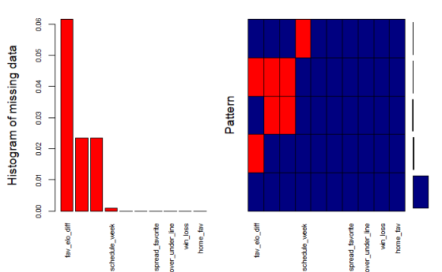
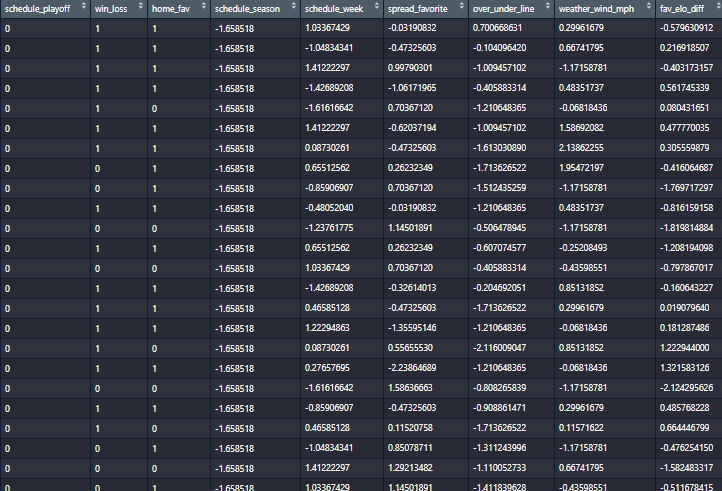
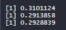
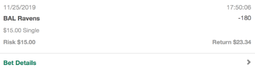

# nfl-sports-betting
Model created to predict outcomes of nfl games with the goal of making bets to win money!
#### -- Project Status: [Active]

## Project Intro/Objective
The purpose of this project is to be able to accurately predict the outcome of NFL matches using various algorithms and interesting features. Me and my group of friends collectively contributed $200 (with an extra $100 donated by my professor) to bet on the model's predictions. The stakes are high!

### Methods Used
* Exploratory Analysis
* SVM
* Random Forest
* Logistic Regression
* Ensemble Methods

### Technologies/Languages
* R and RStudio

## Project Description
Being extremely interested in football, I decided to try and predict the outcome of NFL games using data I found on Kaggle, score spreads from sports betting websites, ELO predictions from fivethirtyeight, and some of my own features, to try and see if I can make accurate predictions this season and (hopefully) make some money in the process. In the NFL the home team wins 57% of the time. This can serve as a perfect benchmark when predicting the results of games.

Sports betting in the NFL comprises of three main betting methods: spread betting, moneyline, and over/under. 

### Spread Betting
Like many high scoring sports, NFL wagering is dictated by the point spread. The spread, or line, is a type of side bet that equalizes the chance of winning a wager. The line offered for any given team will be accompanied with a – or + symbol to indicate whether a team is a favorite or an underdog. Although not the focus for this project, the spread could be a useful feature in determining which team the "house" thinks will most likely win the game.

### Over/Under
The concept of betting on totals, or Over/Under, is quite simplistic. The bettor wagers on whether the TOTAL points scored in a game will fall over or under a pre-determined number set by the sportsbook. Like the spread, the Over/Under prediction can also be a predictor of the outcome of a game, since if a game is low-scoring there should be therefore less chances to score, throwing in an element of luck into the game.

### Moneyline
In the parity driven NFL, the phrase “any given Sunday” is more prevalent than ever, which is why Moneyline bets can be very profitable when betting on the underdog. A Moneyline wager is one that is placed on either the favorite or the underdog to win straight up. Optimizing Moneyline bets will be the focus of this project.

## Description of my Current Process
Here's a breakdown of the steps I took and the conclusion I arrived at:

First, I found three different datasets online that will make up the features that I will be testing. They are: 

### 1) Spreadspoke 
Betting websites like www.spreadspoke.com not only release point spread predictions of all weekly games, but also release datasets online of all the NFL games played since 1968 along with their respective features. This data will be the main dataset that I will be cleaning and modeling on.

### 2) Teams
Since the spreadspoke data does not contain the team ID of all teams, a separate dataset of all teams along with their respective short-hands and ID's were found on www.kaggle.com. This dataset will serve as a useful mapping tool for team ID's to team names in case I would want to manipulate home/away team into favourite/underdog team (spoilers, I will!).

### 3) Fivethirtyeight ELO 
Interestingly, www.fivethirtyeight.com is an online sports blog that develops their own ELO rating of team for each season on a rolling basis. I wanted to use some of their features to see whether or not they added to my model's predictive power.

### Cleaning
Next, I began importing the data from this repo and did some preliminary analysis of spreadspoke.csv since that is going to be the main dataframe I'll be working with.

```r
# setting path
path = "https://raw.githubusercontent.com/peanutshawny/nfl-sports-betting/master/data/"
spreadspoke = paste(path, "spreadspoke_scores.csv", sep = "")
teams = paste(path, "nfl_teams.csv", sep = "")
elo = paste(path, "nfl_elo.csv", sep = "")

# reading in core nfl csv, teams csv, and elo csv
nfl_df <- read.csv(spreadspoke, header = TRUE, sep = ",")
teams_df <- read.csv(teams, header = TRUE, sep = ",")
elo_df <- read.csv(elo, header = TRUE, sep = ",")
```

The data looks to be mostly normal, except for the over 2,400 missing values for spread_favorite and over_under_line as they should be some of our main predictors. Upon closer inspection, all spread_favorite and over_under_line is missing for any season before 1978, and should be taken into account before training the model. There also seems to be sporadically-missing weather data, which is small enough that most of it can be fixed through imputation, with the exception of weather_humidity with over 7,500 missing values.



I then removed unecessary features from teams_df, then right outer joining teams_df onto nfl_df and renaming the column names to be team ID's. This will prove useful in mapping home/away teams to favorite/underdog teams later on.

```r
# dropping unnecessary features from teams_df
teams_df <- teams_df[, c(1, 3)]

# merging with nfl_df to map team ids to team names
nfl_df <- merge(nfl_df, teams_df, by.x = "team_home", by.y = "team_name")
nfl_df <- merge(nfl_df, teams_df, by.x = "team_away", by.y = "team_name")

# renaming column names
colnames(nfl_df)[c(18, 19)] <- c("home_id", "away_id")
```

Deleting all rows with blank favourite ID's.

```r
nfl_df <- subset(nfl_df, team_favorite_id != "")

# replacing all remaining blanks into NA's
nfl_df[nfl_df == ""] <- NA
```

Making sure each home/away id matches with each favorite/not favorite id and mapping new scores.

```r
# setting factors to characters so as to avoid errors
nfl_df$home_id <- as.character(nfl_df$home_id)
nfl_df$away_id <- as.character(nfl_df$away_id)

# mapping scores to favorite team instead of home/away to create win/loss variable
nfl_df <- mutate(.data = nfl_df, score_fav = if_else(home_id == team_favorite_id, 
                                                     score_home, score_away))
nfl_df <- mutate(.data = nfl_df, score_notfav = if_else(home_id == team_favorite_id, 
                                                     score_away, score_home))

# mapping new scores to fav/notfav teams
nfl_df <- mutate(.data = nfl_df, win_loss = if_else(score_fav > score_notfav, "fav", "underdog"))
```
Adding home/away win variable, editing weather detail variable to specify indoor/outdoor conditions. Any absence of "DOME" is presumed to have been played outdoors with the roof open.

```r
# setting weather detail to character so as to avoid errors
nfl_df$weather_detail <- as.character(nfl_df$weather_detail)

# need to map out all unique values of weather detail
nfl_df <- mutate(.data = nfl_df, indoor_outdoor = if_else(startsWith(weather_detail, "DOME"), 
                                                          "indoors", "outdoors"))

# deleting original weather detail feature
nfl_df$weather_detail <- NULL
```

Filling in numbers to represent different playoff weeks.

```r
nfl_df$schedule_week <- as.character(nfl_df$schedule_week)

nfl_df$schedule_week[nfl_df$schedule_week == "18"] = "17"
nfl_df$schedule_week[nfl_df$schedule_week == "Wildcard"] <- "18"
nfl_df$schedule_week[nfl_df$schedule_week == "Division"] <- "19"
nfl_df$schedule_week[nfl_df$schedule_week == "Conference"] <- "20"
nfl_df$schedule_week[nfl_df$schedule_week == "Superbowl"] <- "21"

nfl_df$schedule_week <- as.numeric(nfl_df$schedule_week)
```
Grouping elo data by different teams over different time periods. I cut elo_df into two (team1 and team2) to make it easier to work with. Specifically, I thought grouping elo data by year would yield the best results, as team performance could theorietically be averaged out during a season, leading to more stable predictions. This avoided the issue of mapping the exact games by date. The threshold year of 1998 was created to ensure that older games, which should not be accurate depictions of future games, are ommitted from the model.

```r
# cutting out all elo data before threshold year
threshold_year <- 1998
elo_df <- subset(elo_df, season > threshold_year)

# cutting elo_df into two and grouping by team and year, taking the mean qelos of each team
elo_df1 <- elo_df[, c(2, 5, 9, 11, 21, 27)]
elo_df2 <- elo_df[, c(2, 6, 10, 12, 22, 28)]

elo_df1 <- subset(elo_df1, is.na(elo1_post) == FALSE)
elo_df2 <- subset(elo_df2, is.na(elo2_post) == FALSE)

# grouping and summarising
elo_df1 <- group_by(elo_df1, season, team1)
elo_df2 <- group_by(elo_df2, season, team2)

elo_df1 <- elo_df1 %>%
  summarise(elo_prob1 = mean(elo_prob1),
                        elo1_post = mean(elo1_post),
                        qbelo_prob1 = mean(qbelo_prob1),
                        qbelo1_post = mean(qbelo1_post))
elo_df2 <- elo_df2 %>%
  summarise(elo_prob2 = mean(elo_prob2),
                        elo2_post = mean(elo2_post),
                        qbelo_prob2 = mean(qbelo_prob2),
                        qbelo2_post = mean(qbelo2_post))

# changing the name of a column for ease of merging
names(elo_df2)[2] <- "team1"

# recombining the dataframes and joining onto nfl_df
elo_df <- merge(elo_df1, elo_df2, by = c("team1", "season"))
```

Taking the mean of a feature depending on when a team has been home/away, then joining onto nfl_df by season and team ID. I only joined on raw ELO score, as all metrics in the dataset were highly correlated.

```r
# joining onto nfl_df and mapping respective features to fav/underdog teams
elo_df <- elo_df %>%
  rowwise()%>%
  mutate(elo_prob = mean(c(elo_prob1, elo_prob2))) %>%
  mutate(elo = mean(c(elo1_post, elo2_post))) %>%
  mutate(qbelo_prob = mean(c(qbelo_prob1, qbelo_prob2))) %>%
  mutate(qbelo = mean(c(qbelo1_post, qbelo2_post))) 

elo_df <- elo_df[, -c(3:10)]

# joining on only elo, all other variables were extremely similar
elo_df <- elo_df[, c(1, 2, 4)]

nfl_df <- merge(nfl_df, elo_df, by.x = c("schedule_season", "home_id"), by.y = c("season", "team1"), all = TRUE)
nfl_df <- merge(nfl_df, elo_df, by.x = c("schedule_season", "away_id"), by.y = c("season", "team1"), all = TRUE)

# changing elo column names, then taking qbelo differential and mapping onto fav/underdog teams
colnames(nfl_df)[c(23:24)] <- c("home_elo", "away_elo")

nfl_df <- nfl_df %>% mutate(fav_elo = if_else(home_id == team_favorite_id, home_elo, away_elo)) %>%
  mutate(underdog_elo = if_else(home_id == team_favorite_id, away_elo, home_elo)) %>%
  mutate(fav_elo_diff = fav_elo - underdog_elo) 
```

Adding the "underdog/favorite home team" feature. I had a hunch that the favorite team would have a higher chance of winning when they also the home team, since home teams by default win 57% of games. In contrast, the underdog team would also have a higher chance of winning if they were playing at home, balancing the odds in their favor.

```r
nfl_df <- mutate(.data = nfl_df, home_fav = if_else(home_id == team_favorite_id, "home_fav", "home_underdog"))
```

Deleting all unecessary features.

```r
# deleting all rows with NA favorite ID's and anything before a certain year
nfl_df <- subset(nfl_df, team_favorite_id != "")
nfl_df <- subset(nfl_df, schedule_season > threshold_year)

# using only 13 features
nfl_df <- nfl_df[, c(1, 7, 8, 12, 13, 16, 17, 18, 21, 22, 27, 28)]
```

Imputing NA values using various methods from the MICE package

```r
# plotting missing values
aggr_plot <- aggr(nfl_df, col=c('navyblue','red'), numbers = TRUE, sortVars = TRUE, 
                  labels=names(nfl_df), cex.axis=.7, gap=3, ylab=c("Histogram of missing data","Pattern"))

```



Because over 70% of indoor_outdoor and over 50% of weather_humidity is missing, I will need to delete those columns as I have no way of imputing the data accurately.

```r
nfl_df$indoor_outdoor <- NULL
nfl_df$weather_humidity <- NULL

aggr_plot <- aggr(nfl_df, col=c('navyblue','red'), numbers = TRUE, sortVars = TRUE, 
                  labels=names(nfl_df), cex.axis=.7, gap=3, ylab=c("Histogram of missing data","Pattern"))
```



As all features now all fall within the exceptable range of NA values (~5%), I used the mice package to impute all missing values with the predictive mean value method.

```r
# create a mice dataset
imputed_data <- mice(data = nfl_df, m = 5, method = "pmm", maxit = 5, seed = 500)

# complete the imputation
nfl_df <- complete(imputed_data, 1)
```

### Modeling
Normalizing, then separating into training/testing.

```r
# re-arranging and making sure all features are in the correct order in order to normalize
nfl_df <- nfl_df[, c(3, 8, 10, 1, 2, 4, 5, 7, 9)]
```

Calculating the size of training/testing, mean/sd of schedule seasons, and the appropriate cut off date before normalizing, as normalization is detrimental to the interpretation of the season feature. I benchmarked the testing set to be 20% of the data and calculated the number of years from the total number of years still present in the dataset.

```r
# optimal testing size
test_size <- 0.2
total_years <- max(nfl_df$schedule_season) - min(nfl_df$schedule_season)
test_years <- round(test_size * total_years)

season_mean <- mean(c(min(nfl_df$schedule_season):max(nfl_df$schedule_season)))
season_sd <- sd(c(min(nfl_df$schedule_season):max(nfl_df$schedule_season)))

cut_off <- ((max(nfl_df$schedule_season) - test_years) - season_mean)/season_sd

# characterizing and normalizing
for (i in 1:ncol(nfl_df)){
  if (i <= 3){
    nfl_df[, i] = as.character(nfl_df[, i])
  } else {
    nfl_df[, i] = (nfl_df[, i] - mean(nfl_df[, i]))/sd(nfl_df[, i])
  }
}

# converting into dummies for consistency among models
nfl_df <- nfl_df %>%
  mutate(schedule_playoff = if_else(schedule_playoff == "TRUE", 1, 0)) %>%
  mutate(win_loss = if_else(win_loss == "fav", 1, 0)) %>%
  mutate(home_fav = if_else(home_fav == "home_fav", 1, 0))

# training/testing split
training_set <- nfl_df[nfl_df$schedule_season <= cut_off, ]
testing_set <- nfl_df[nfl_df$schedule_season > cut_off, ]
```

This should be the final dataset before going into the modeling phase. All cateogrical features have been made into dummies for ease of training between different models. All numerical features have been normalized before being split up into training/testing.



Building Models, including a KNN, Randomforest, Logistic Regression, and SVM.

```r
svm_model <- svm(win_loss ~., data = training_set, kernel = "radial", cost = 5)
forest_model <- randomForest(win_loss ~., data = training_set, ntree = 150 )
log_model <- glm(win_loss ~., data = training_set, family = binomial(logit))
```

Making predictions and rounding to later calculate misclassification.

```r
svm_predictions <- predict(svm_model, testing_set, type = "response")
svm_predictions <- round(svm_predictions)

forest_predictions <- predict(forest_model, testing_set, type = "response")
forest_predictions <- round(forest_predictions)

log_predictions <- predict(log_model, testing_set, type = "response")
log_predictions <- round(log_predictions)
```

Evaluating errors, including the misclassification rate, false positive rate, and false negative rate.

```r
# svm error
wrong <- sum(svm_predictions != testing_set$win_loss)
misclassification_rate <- wrong/nrow(testing_set)
print(misclassification_rate)

# random forest errors
wrong <- sum(forest_predictions != testing_set$win_loss)
misclassification_rate <- wrong/nrow(testing_set)
print(misclassification_rate)

# logistic regression error
wrong <- sum(log_predictions != testing_set$win_loss)
misclassification_rate <- wrong/nrow(testing_set)
print(misclassification_rate)
```

Below are the results of my three models before any major hyperparameter tuning. It's good to see that at around 70% accuracy, my models beat the 57% of the home team winning.



Because I was curious about ensemble methods, I decided to then build an ensemble model that used a max voting method to combine these three models and see if the accuracy improves. I first had to test the correlation between all model predictions, as there is not to voting if all models output similar predictions.

```r
# building prediction dataframe
pred_df <- data.frame(svm_predictions, forest_predictions, log_predictions)

# measuring correlation between model predictions
cor(pred_df)
```

Seems the models are approaching, but don't reach the threshold for high correlation of 0.75. It seems reasonable to still build the ensemble.

```r
# building ensemble predictions that performs a majority vote 
ensemble_predictions <- pred_df %>%
  rowwise() %>%
  transmute(en_pred = if_else(sum(svm_predictions, forest_predictions, log_predictions) >= 2, 
                              1, 0))

# calculating misclassification/FP/FN
wrong <- sum(ensemble_predictions != testing_set$win_loss)
misclassification_rate <- wrong/nrow(testing_set)
print(misclassification_rate)

false_positive <- sum(ensemble_predictions == 1 & testing_set$win_loss == 0)
false_negative <- sum(ensemble_predictions == 0 & testing_set$win_loss == 1)

false_positive_rate <- false_positive/nrow(testing_set)
false_negative_rate <- false_negative/nrow(testing_set)

print(false_positive_rate)
print(false_negative_rate)
```

In the end, our ensemble model outperformed the logistic regression by 0.3%, a very slight improvement.


### Betting Real Money!
After building this model, a group of friends and I felt confident enough to pool together $200 between five of us to start making bets on the model predictions, below is an example of us winning a Moneyline bet on the Baltimore Ravens:



Stay tuned until the end of the 2019 season where I will announce our total winnings/losses! 

## Conclusion & Next Steps
All in all, I learned a lot about cleaning data in r, sports betting, and the different types of classical ML algorithms one can apply to solves problems like this. 

Next Steps:
* Find or create more interesting features (player injury rate, rolling average win rate, head-to-head win rate, win streak)
* Fine-tune each model before inputting into the ensemble
* Research a way to fine-tune the ensemble for higher predictive power
* Explore different betting strategies to maximize financial gain, perhaps even to the extent of layering an additional model that optimizes for the most money won.
* Continue making bets!

## Contact
Feel free to email me at shawnliu30@gmail.com if you want to talk about this project or data science in general!
